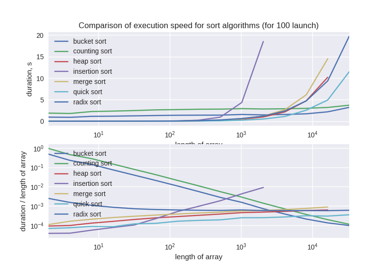
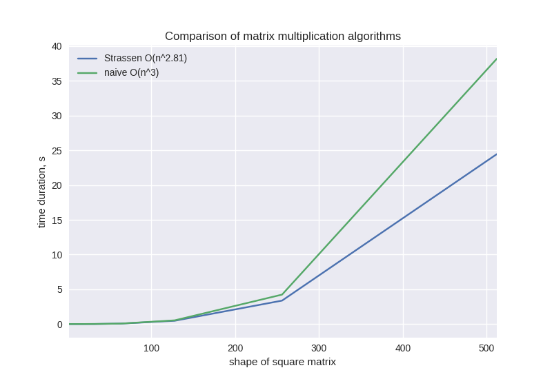

# Fun with algorithms

This repository was created during the study of [Introduction to Algorithms, Third Edition By Thomas H. Cormen, Charles E. Leiserson, Ronald L. Rivest and Clifford Stein](https://mitpress.mit.edu/books/introduction-algorithms) book.

A well-written book with detailed implementation of algorithms.

List of algorithms presented in the book.

- Chapter 1.
  - [Insertion sort](sort/insertionsort.py)
- Chapter 2.
  - [Merge sort](sort/mergesort.py)
  - Bubble sort
- Chapter 3.
  - Fibonacci numbers
- Chapter 4.
  - Maximum subarray problem
  - [Square matrix multiply](matrix/multiplication.py)
  - [Strassen algorithm](matrix/multiplication.py)
- Chapter 5.
  - Hire assistant problem.
  - Birthday problem.
- Chapter 6.
  - [Max Heap](queue/maxheap.py)
  - [Heap sort](sort/heapsort.py)
  - Priority queue
- Chapter 7.
  - [Quick sort](sort/quicksort.py)
  - [Randomized quick sort](sort/quicksort.py)
- Chapter 8.
  - [Counting sort](sort/countingsort.py)
  - [Radix sort](sort/radixsort.py)
  - [Bucket sort](sort/bucketsort.py)
- Chapter 9.
  - [Order statistic](sort/selectstatistic.py)
- Chapter 10.
  - [Stack](stack/stack.py)
  - [Queue](queue/queue.py)
  - [Singly linked list](linkedlist/singly_linked.py)
  - [Doubly linked list](linkedlist/doubly_linked.py)
  - [Linked list with open addressing](linkedlist/open_addressing.py)
- Chapter 11.
  - [Hash table](hashing/hash_table.py)
  - Hash with open addressing
  - [Double Hashing](hashing/double_hashing.py)
  - Perfect hashing
- Chapter 12.
  - [Binary Search Tree](trees/binarytree.py)
- Chapter 13.
  - [Red-black Tree](trees/redblacktree.py)
- Chapter 14.
  - Order-statistic tree
  - [Josephus problem](other/josephus.py)
- Chapter 15.
  - [Rod cutting problem](dynamicprogramming/cut_rod.py)
  - [Matrix chain multiplication problem](dynamicprogramming/matrix_chain_order.py)
  - [Longest common subsequence problem](dynamicprogramming/longest_common_subsequence.py)
  - Optimal binary search tree
  - [Edit distance](dynamicprogramming/edit_distance.py)
- Chapter 16.
  - [Activity selection problem.](greedy/activity_selection.py)
  - [Knapsack problem.](greedy/knapsack_problem.py)
  - Huffman coding.
- Chapter 17.
  - [Dynamic Hashing](hashing/hash_table.py)
- Chapter 18.
  - [B-tree](trees/btree.py)
- Chapter 19.
  - Fibonacci heap
- Chapter 20.
  - Van Emde Boas tree
- Chapter 21.
  - Disjoining-set data structure
  - Disjoining-set forest
  - Least common ancestor
- Chapter 22.
  - [Breadth-first search](graph/breadth_first_search.py)
  - [Depth-first search](graph/depth_first_search.py)
  - [Topological sort](graph/topological_sorting.py)
- Chapter 23.
  - [Kruskal's algorithm](graph/kruskal.py)
  - Prim's algorithm
- Chapter 24.
  - [Bellman-Ford algorithm](graph/bellman_ford.py)
  - [Dijkstra's algorithm](graph/dijkstra.py)
- Chapter 25.
  - [Floyd-Warshall algorithm](graph/floyd_warshall.py)
  - Johnson's algorithm
- Chapter 26.
  - Maximum flow problem
  - Ford–Fulkerson algorithm
  - Relabel-to-front algorithm
- Chapter 27.
  - [Fibonacci number using multithreading](multithreading/fib.py)
  - [Matrix multiplication using multithreading](multithreading/matrixmultiply.py)
  - Multithreading Strassen algorithm
  - Multithreading merge sort
- Chapter 28.
  - LU decomposition
  - [LUP decomposition](matrix/lupdecomposition.py)
  - Invertible matrix
- Chapter 29.
  - Simplex algorithm.
- Chapter 30.
  - [Recursive FFT.](fft/fft.py)
  - Iterative FFT.
  - Parallel FFT.
- Chapter 31.
  - [Euclid algorithm.](other/greatestcommondivisor.py)
  - Modular exponentiation.
  - RSA algorithm.
  - Pseudoprime.
  - Miller–Rabin primality test.
  - Pollard's rho algorithm.
  - Binary GCD algorithm.
- Chapter 32.
  - [String searching algorithm.](string/stringsearch.py)
  - Rabin–Karp algorithm.
  - Knuth–Morris–Pratt algorithm.
- Chapter 33.
  - Line segment intersection.
  - Graham scan.
  - Gift wrapping algorithm.
- Chapter 34.
- Chapter 35.
  - Approximate vertex cover.
  - Approximate travelling salesman problem.
  - Greedy set cover.
  - Exact subset sum.

## Sort algorithms comparison

Table of complexity of different sorting algorithms:

| Algorithm       | Worst case | Average case |
|-----------------|------------|--------------|
| Insertion Sort  | O(n^2)     | O(n^2)       |
| Merge Sort      | O(n*ln(n)) | O(n*ln(n))   |
| Heap Sort       | O(n*ln(n)) | O(n*ln(n))   |
| Quick Sort      | O(n^2)     | O(n*ln(n))   |
| Counting Sort   | O(k + n)   | O(k + n)     |
| Radix Sort      | O(d(k + n))| O(d(k + n))  |
| Bucket Sort     | O(n^2)     | O(n)         |

## Matrix multiplication

- Naive matrix multiplication O(n^3)
- Strassen matrix multiplication O(n^2.81)

## Performance charts

For plot beautiful performance chart run following command.

~~~sh
python sort/performance.py
~~~

~~~sh
python matrix/performance.py
~~~

## Additional

- [Performance comparison finding Fibonacci number](fibonacci/performance.py)
- [Performance of basic math operation](operations/performance.py)

## Useful links:

- [Performance comparison Naive and Strassen algorithms in Python, Java and C++](https://martin-thoma.com/strassen-algorithm-in-python-java-cpp/)
- [Matrix Operations in Python](http://www.mathwizurd.com/blog/2015/6/14/matrix-operations-in-python)
- [LU Decomposition in Python and NumPy](https://www.quantstart.com/articles/LU-Decomposition-in-Python-and-NumPy)
- [LU decomposition](https://rosettacode.org/wiki/LU_decomposition)
- [Inverting your very own matrix](http://www.vikparuchuri.com/blog/inverting-your-very-own-matrix/)

### Linked Lists

- [Implementing an Unordered List: Linked Lists](http://interactivepython.org/courselib/static/pythonds/BasicDS/ImplementinganUnorderedListLinkedLists.html)
- [The Linked List](https://code.tutsplus.com/tutorials/the-linked-list--cms-20660)

### Binary Tree

- [Binary Search Tree library in Python](http://www.laurentluce.com/posts/binary-search-tree-library-in-python/)
- [Search Tree Implementation](http://interactivepython.org/runestone/static/pythonds/Trees/SearchTreeImplementation.html)
- [Binary search tree](http://www.algolist.net/Data_structures/Binary_search_tree)
